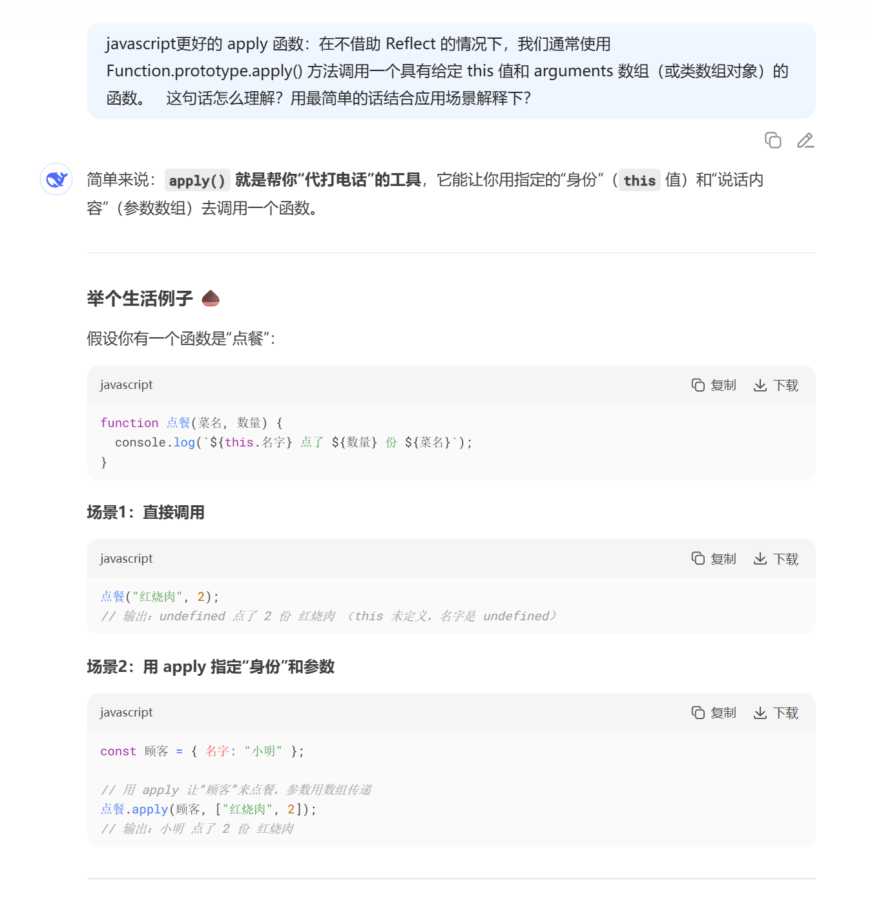
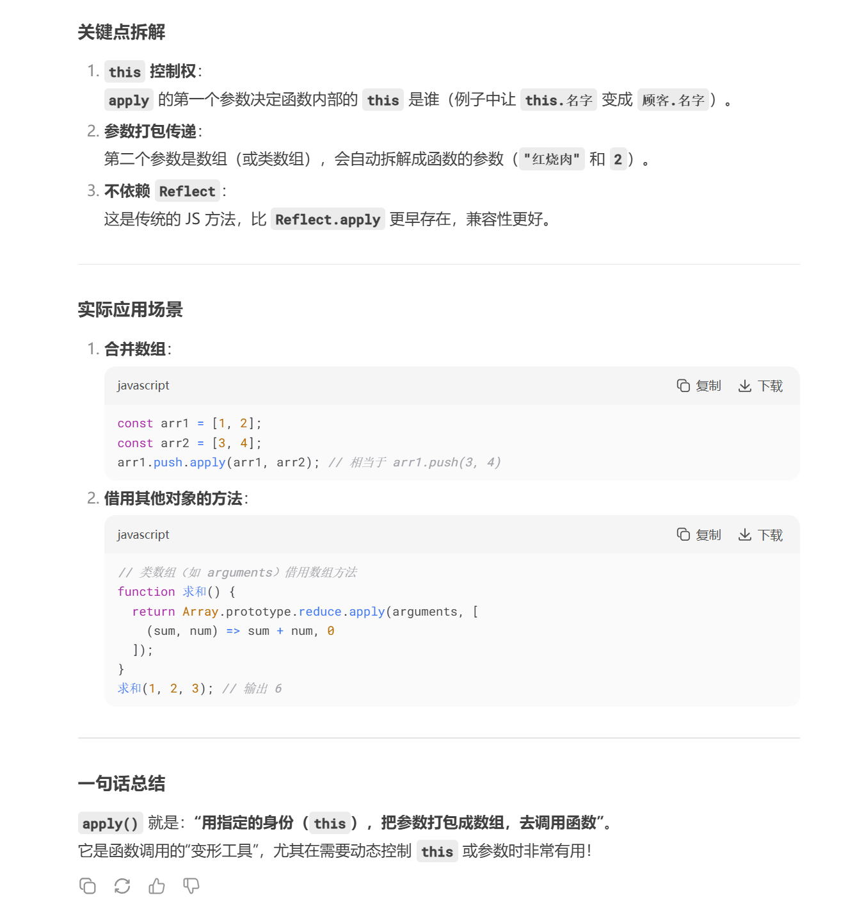

# AI 应用场景

## 一、智能学习知识

### 1.1 帮助理解知识

**背景**：作为一名前端程序员，在学习 JavaScript 时，Function.prototype.apply() ，看了以后不理解他的用途，是什么？为什么要有这个方法？以及何时用该方法？

**DeepSeek 提问**：

> 更好的 apply 函数：在不借助 Reflect 的情况下，我们通常使用 Function.prototype.apply() 方法调用一个具有给定 this 值和 arguments 数组（或类数组对象）的函数。  
> 上述：这句话怎么理解？用最简单的话结合应用场景解释下？

**DeepSeek 回答**：

[截图 2](./aaa.md)
