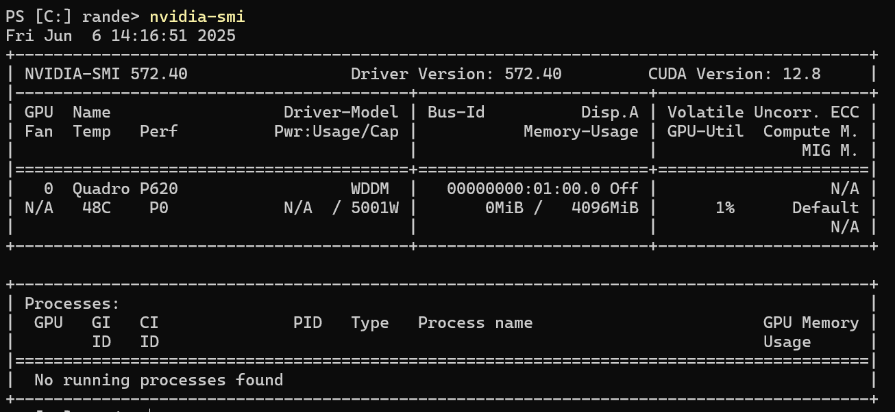
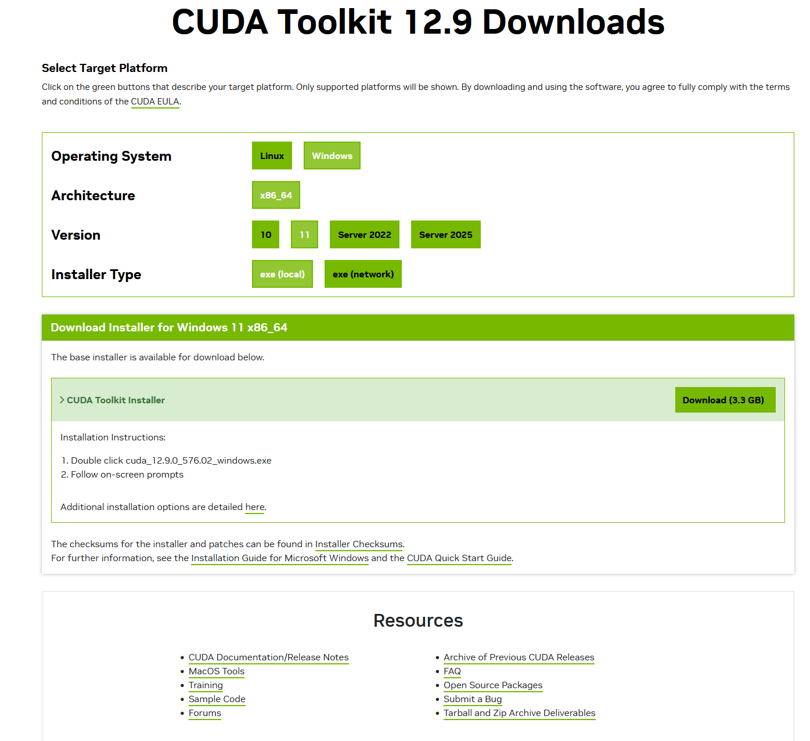

# 安装

## 安装 Miniconda 和 Jupyter Notebook

[官方下载 CUDA Toolkit](https://www.anaconda.com/docs/getting-started/miniconda/install#quickstart-install-instructions)

## 使用 coda 新建虚拟环境

```bash
conda init

# 现在关闭并重新打开当前的shell。并使用下面的命令创建一个新的环境：
conda create --name d2l python=3.12 -y
# 现在激活 d2l 环境：
conda activate d2l
```

## 安装深度学习框架和 d2l 软件包

### 检查清单

1. 检查设备是否有 NVIDIA GPU;
2. 如果有，检查设备是否已安装的 CUDA;
3. 如果未安装，确认 NVIDIA GPU 型号并下载对应 CUDA Toolkit 以及安装 ;

#### 确认 NVIDIA GPU 型号

```bash
 nvidia-smi  # 查看驱动和GPU状态
```



#### 下载对应 CUDA Toolkit

[官方下载 CUDA Toolkit](https://developer.nvidia.com/cuda-downloads)


```bash

pip install torch
pip install torchvision

pip install tensorflow
pip install tensorflow-probability
```
