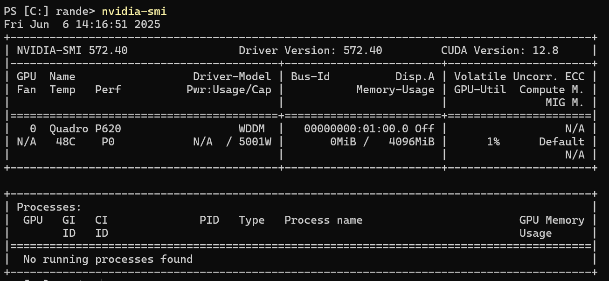
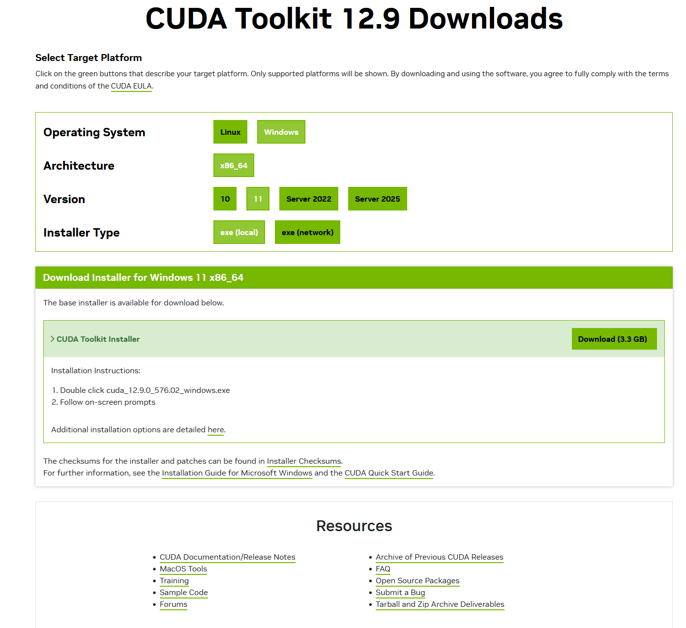
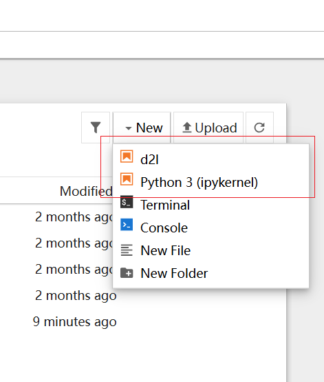

# 环境搭建

## 安装环境及版本

Windows 11 家庭中文版 24H2

## 安装 Miniconda 和 Jupyter Notebook

[官方下载 CUDA Toolkit](https://www.anaconda.com/docs/getting-started/miniconda/install#quickstart-install-instructions)

## 使用 coda 新建虚拟环境

```bash
conda init

# 现在关闭并重新打开当前的shell。并使用下面的命令创建一个新的环境：
conda create --name d2l python=3.12 -y
# 现在激活 d2l 环境：
conda activate d2l
```

## 安装深度学习框架和 d2l 软件包

### 检查清单

1. 检查设备是否有 NVIDIA GPU;
2. 如果有，检查设备是否已安装的 CUDA;
3. 如果未安装，确认 NVIDIA GPU 型号并下载对应 CUDA Toolkit 以及安装 ;

#### 确认 NVIDIA GPU 型号

```bash
 nvidia-smi  # 查看驱动和GPU状态
```



#### 下载对应 CUDA Toolkit

[官方下载 CUDA Toolkit](https://developer.nvidia.com/cuda-downloads)


```bash

pip install torch
pip install torchvision

pip install tensorflow
pip install tensorflow-probability
```

## Jupyter Notebook 工具安装和使用

1. **共享安装（全局使用）** ：如果你在 base（默认）环境 中安装了 Jupyter Notebook，并且未在其他环境中单独安装，那么所有 Conda 环境都可以通过以下方式共享使用：

    - 在 base 环境启动 Jupyter Notebook。
    - 通过 内核（Kernel）切换 选择其他 Conda 环境的 Python 解释器（需提前注册内核）。

- 优点：只需维护一个 Jupyter Notebook 实例。
- 缺点：Notebook 的依赖（如 ipykernel、notebook 等）需与 base 环境兼容。

### 如何注册其他环境的内核？

```bash
# 激活目标环境
conda activate d2l

# 安装 ipykernel (可省略)
conda install ipykernel

# 注册内核（可自定义显示名称）
python -m ipykernel install --user --name d2l --display-name "Python (d2l)"
```



2.**独立安装（每个环境一套）** ：如果你在每个 Conda 环境中单独安装 Jupyter Notebook，那么你需要在每个 Conda 环境中单独安装 Jupyter Notebook（例如在每个环境中运行 conda install jupyter），则每个环境会拥有独立的 Jupyter Notebook 副本及其依赖。

- 优点：环境完全隔离，避免依赖冲突。
- 缺点：占用更多磁盘空间，需分别维护。

3.**验证方式**

```bash

# 查看jupyter版本
jupyter notebook --version

# 列出所有已注册内核
jupyter kernelspec list
```
